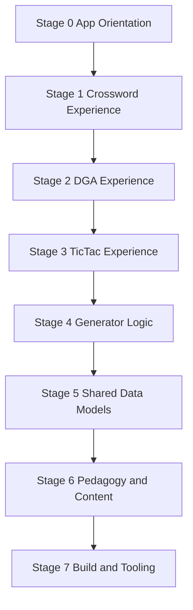

# Module Manifest · Staged Documentation Plan

## Purpose and Usage
- Establish a living knowledge base that traces every significant module, feature workflow, and supporting resource in this repository.
- Serve as the control document for iterative documentation sprints; each stage below can be executed independently while keeping context bounded.
- Provide enough orientation that future contributors can quickly identify which files require updates when modifying a feature.

## Stage Roadmap Overview

## Stage Details

### Stage 0 · App Orientation and State Topology
- **Objective**: Capture the application shell, tab coordination, and shared UI scaffolding so later stages can reference established patterns.
- **Files**: [`App.tsx`](App.tsx), [`index.tsx`](index.tsx), [`index.html`](index.html), [`index.css`](index.css).

#### App orchestration [`App.tsx`](App.tsx)
- **Purpose**: [`App`](App.tsx:81) owns top-level state for all puzzle modes, mediates curriculum ingestion, and binds download/render controls projected into the right-column canvas.
- **Key Exports**:
  - [`App.cloneCrosswordResult()`](App.tsx:15), [`App.cloneDgaResult()`](App.tsx:22), [`App.cloneTicTacResult()`](App.tsx:28) enforce immutability guarantees whenever generator outputs are stored or rehydrated.
  - [`App`](App.tsx:81) as the default export consumed by [`index.tsx`](index.tsx:4).
- **State & Side Effects**:
  - Word and clue buffers [`inputWords`](App.tsx:82) and [`inputClues`](App.tsx:83) gate downstream generator availability; clearing them resets all puzzle results inside a guarding [`useEffect`](App.tsx:365).
  - Result holders [`result`](App.tsx:97), [`dgaResult`](App.tsx:100), [`ticTacResult`](App.tsx:104) pair with tab-specific status via [`statusByTab`](App.tsx:118).
  - Tab rendering side effects are centralized within a responsive [`useEffect`](App.tsx:454) that orchestrates canvas drawing, ensuring solution overlays and mode toggles remain in sync with sizing changes.
- **Upstream/Downstream Links**:
  - Imports generator engines ([`CrosswordGenerator`](utils/crosswordGenerator.ts:1), [`DGAGenerator`](utils/dgaGenerator.ts:1), [`TicTacGenerator`](utils/tictacGenerator.ts:1)) and renderer helpers ([`drawCrossword`](components/CrosswordCanvas.ts:1), [`drawDGACanvas`](components/DGACanvas.ts:1), [`drawTicTacCanvas`](components/TicTacCanvas.ts:1)).
  - Emits props into [`CluesList`](components/CluesList.tsx:1) and [`PedagogyModal`](components/PedagogyModal.tsx:1) to surface feature-specific context.
- **Change Considerations**:
  - When introducing new puzzle tabs, mirror the `DEFAULT_STATUSES` shape [`DEFAULT_STATUSES`](App.tsx:47) and extend [`handleGenerate`](App.tsx:344) plus download handlers to preserve parity across solution exports.
  - Maintain cloning helpers whenever generator output schemas evolve to prevent lingering references from mutating historical state.
  - Any curriculum schema adjustments must keep [`handleLoadCurriculum`](App.tsx:413) synchronized with naming conventions used in [`curriculumData`](curriculumData.ts:1).

#### DOM bootstrap and hardening [`index.tsx`](index.tsx)
- **Purpose**: Initializes translation guards before mounting React, then hydrates [`App`](App.tsx:81) into the root container.
- **Key Exports**:
  - [`installDomMutationGuards`](index.tsx:6) wraps native DOM mutation APIs to block third-party translation overlays that would disturb the canvas layout.
- **State & Side Effects**:
  - Patches prototype methods (`removeChild`, `insertBefore`, `appendChild`, `setAttribute`) and installs a [`MutationObserver`](index.tsx:123) to sanitize injected nodes and attributes at runtime.
- **Upstream/Downstream Links**:
  - Imports styling from [`index.css`](index.css:1) prior to guard installation to ensure Tailwind utilities are available during first render.
  - Creates the root via [`ReactDOM.createRoot`](index.tsx:171) and renders [`App`](App.tsx:81) inside [`React.StrictMode`](index.tsx:173).
- **Change Considerations**:
  - Any additional global guards must respect the `guardToken` flag [`guardToken`](index.tsx:7) to avoid reapplying patches on hot reload.
  - When modifying mount logic, keep the explicit root-element existence check [`rootElement`](index.tsx:166) to surface configuration errors early.

#### Document shell [`index.html`](index.html)
- **Purpose**: Supplies a translation-resistant HTML scaffold and injects the Vite entry script for the React bundle.
- **Key Exports**: n/a (static markup).
- **State & Side Effects**:
  - Sets `translate="no"` and the `notranslate` class on the `<html>` root [`index.html`](index.html:2) to complement runtime guards.
  - Declares `
` [`index.html`](index.html:11) as the single mount target referenced inside [`index.tsx`](index.tsx:166).
- **Upstream/Downstream Links**:
  - Loads the compiled application via `<script type="module" src="/index.tsx">` [`index.html`](index.html:13), allowing Vite to resolve TypeScript entry points directly.
- **Change Considerations**:
  - Preserve the translation-disabling attributes and metadata to keep UI text stable for ESL classroom usage.
  - Any additional global wrappers must maintain the semantic structure expected by the DOM guards (single root container).

#### Global styling layer [`index.css`](index.css)
- **Purpose**: Imports Tailwind and sets global translation and bidi constraints that protect rendered puzzles from external mutation.
- **Key Exports**: n/a (stylesheet rules applied globally).
- **State & Side Effects**:
  - Imports the Tailwind pipeline [`@import "tailwindcss"`](index.css:1) relied upon by class utilities throughout [`App.tsx`](App.tsx:554).
  - Applies `translate: no` overrides on `.notranslate` selectors [`index.css`](index.css:6) and enforces `unicode-bidi: isolate` [`index.css`](index.css:12) to keep bilingual text alignment predictable.
- **Upstream/Downstream Links**:
  - Consumed directly by the Vite entry [`index.tsx`](index.tsx:3) ensuring styles load before React renders.
- **Change Considerations**:
  - Tailwind configuration changes (Stage 7) must continue exporting the `tailwindcss` entry so this import chain stays valid.
  - Introduce additional globals cautiously; they affect canvas sizing and should be documented under Stage 7 if they alter layout primitives.

### Stage 1 · Crossword Experience Surfaces
- **Objective**: Detail how crossword-specific UI and canvas rendering operate, including status feedback and clue presentation.
- **Files**: [`components/CrosswordCanvas.ts`](components/CrosswordCanvas.ts), [`components/CluesList.tsx`](components/CluesList.tsx), crossword-centric sections of [`App.tsx`](App.tsx).

#### Crossword orchestration within [`App.tsx`](App.tsx)
- **Purpose**: [`App.generateCrossword`](App.tsx:210) transforms raw text input into placed-word data, selects grid sizing, and governs user messaging across the crossword tab.
- **Key Exports / Functions**:
  - [`App.generateCrossword`](App.tsx:210) normalizes user words, pairs clues, computes grid size, and calls [`CrosswordGenerator.generate`](utils/crosswordGenerator.ts:1) before applying success/error statuses.
  - Status builders invoked via [`setTabStatus`](App.tsx:137) yield feedback variants for empty input, placement failures, and partial usage scenarios (see [`buildStatus`](App.tsx:77)).
  - Download triggers [`App.handleDownloadSingle`](App.tsx:512) and [`App.handleDownload2Up`](App.tsx:528) route crossword data into canvas exporters with mode-aware suffixes.
- **State & Side Effects**:
  - On success, [`setResult`](App.tsx:106) stores a cloned [`GenerationResult`](types.ts:24) which downstream render cycles depend on; unused words trigger warning copy with a summarized tail [`summarizeList`](App.tsx:71).
  - Canvas refresh effect [`useEffect`](App.tsx:454) re-renders whenever puzzle state, `mode`, or `showSolution` toggles change, ensuring overlays align with the current dataset.
- **Upstream/Downstream Links**:
  - Consumes generator output to feed [`drawCrossword`](components/CrosswordCanvas.ts:35) and conditionally renders [`CluesList`](components/CluesList.tsx:78) for standard mode.
  - Shares placed words with export helpers [`downloadSinglePage`](components/CrosswordCanvas.ts:546) and [`download2UpPage`](components/CrosswordCanvas.ts:559).
- **Change Considerations**:
  - Any adjustment to clue-parsing conventions must be coordinated with [`parseClue`](components/CrosswordCanvas.ts:26) and [`CluesList.parseClue`](components/CluesList.tsx:11) to avoid mismatched POS badges.
  - Expanding crossword modes requires updating mode toggles in the toolbar [`mode` switcher](App.tsx:743) and branching logic inside [`drawCrossword`](components/CrosswordCanvas.ts:35).
  - Preserve bilingual status strings when altering messaging blocks (success path [`App.setTabStatus` success branch](App.tsx:261)).

#### Canvas rendering and exports [`components/CrosswordCanvas.ts`](components/CrosswordCanvas.ts)
- **Purpose**: Converts logical grid data into both on-screen previews and high-resolution printable layouts for single and two-up distribution.
- **Key Exports**:
  - [`drawCrossword`](components/CrosswordCanvas.ts:35) renders interactive previews with DPI scaling, intersection highlighting for deduction mode, and solution overlays when requested.
  - [`downloadSinglePage`](components/CrosswordCanvas.ts:546) and [`download2UpPage`](components/CrosswordCanvas.ts:559) orchestrate printable exports using the shared [`createHighResCanvas`](components/CrosswordCanvas.ts:159) pipeline.
- **State & Side Effects**:
  - Internally computes intersection caches [`getIntersections`](components/CrosswordCanvas.ts:5) to determine deduction-mode reveals.
  - `createHighResCanvas` standardizes A4 layout, wraps clues via [`getWrappedLines`](components/CrosswordCanvas.ts:123), and enforces strict clue column bounds for printing.
- **Upstream/Downstream Links**:
  - Expects [`Grid`](types.ts:22) and [`PlacedWord`](types.ts:9) contracts produced by generators and stored in [`App.result`](App.tsx:97).
  - Deduction word banks mirror the grouping logic used in [`CluesList`](components/CluesList.tsx:23), keeping on-screen and export experiences aligned.
- **Change Considerations**:
  - Any modifications to clue badge styling or wrap heuristics must remain consistent with on-screen representation inside [`CluesList`](components/CluesList.tsx:60).
  - Adjusting DPI or page sizing requires revisiting downstream consumers (print workflows) and ensuring [`download2UpPage`](components/CrosswordCanvas.ts:559) still fits within cut lines.
  - Maintain `triggerDownload` safeguards when introducing alternate export formats to avoid cross-origin restrictions.

#### Clue presentation [`components/CluesList.tsx`](components/CluesList.tsx)
- **Purpose**: Displays across/down clues or word-bank groupings that mirror the printable layout, allowing teachers to preview classroom material before export.
- **Key Exports**:
  - Default [`CluesList`](components/CluesList.tsx:21) component renders mode-specific layouts based on `CrosswordMode`.
  - Local [`parseClue`](components/CluesList.tsx:11) ensures POS detection for badge rendering matches the canvas exporter.
- **State & Side Effects**:
  - Stateless; relies entirely on props provided by [`App`](App.tsx:837). Word length hints appended inline support scaffolding needs.
- **Upstream/Downstream Links**:
  - Delegated `words` prop is taken from [`result.placedWords`](App.tsx:838); any generator schema change must keep property names stable.
  - Styling choices (Tailwind classes) assume the global Tailwind import chain established in Stage 0.
- **Change Considerations**:
  - When expanding deduction viewports, keep grouping logic synchronized with [`createHighResCanvas`](components/CrosswordCanvas.ts:467) to avoid mismatched sections.
  - POS parsing updates must remain regex-compatible across both CluesList and canvas helpers to retain consistent badge casing and punctuation.
- **Documentation Deliverable**: Include the clue rendering flow, badge formatting rules, and the interplay between screen preview and export formatting so contributors can adjust puzzle presentation with confidence.

### Stage 2 · DGA Logic Puzzle Experience
- **Objective**: Explain the deduction-grid assembly UI and rendering pathway.
- **Files**: [`components/DGACanvas.ts`](components/DGACanvas.ts), DGA sections of [`App.tsx`](App.tsx).

#### DGA orchestration within [`App.tsx`](App.tsx)
- **Purpose**: [`App.generateDGA`](App.tsx:269) validates input density, invokes the logic-grid generator, and synchronizes tab-level messaging and downloads for the DGA experience.
- **Key Exports / Functions**:
  - [`App.generateDGA`](App.tsx:269) uppercases and deduplicates user words before calling [`DGAGenerator.generate`](utils/dgaGenerator.ts:1); failure branches surface bilingual errors via [`setTabStatus`](App.tsx:137).
  - Word-count selector state [`dgaWordCount`](App.tsx:101) drives the generator parameter and is exposed in the toolbar selector [`App` toolbar](App.tsx:750).
  - Download wiring [`App.handleDownloadSingle`](App.tsx:517) and [`App.handleDownload2Up`](App.tsx:533) defer to [`downloadDGACanvas`](components/DGACanvas.ts:297) and [`downloadDGA2Up`](components/DGACanvas.ts:307).
- **State & Side Effects**:
  - Successful generation stores a cloned [`DGAResult`](types.ts:44) via [`setDgaResult`](App.tsx:110), ensuring immutability and preserving the matching-words arrays for solution overlays.
  - Status copy indicates solvability and word-bank size [`App.setTabStatus`](App.tsx:302); errors reference threshold requirements (min six words or generator-specific messages).
- **Upstream/Downstream Links**:
  - Feeds stored results into [`drawDGACanvas`](components/DGACanvas.ts:263) inside the shared canvas-draw effect [`useEffect`](App.tsx:454).
  - Shares `showSolution` toggles with the renderer to reveal scratchpad annotations on demand.
- **Change Considerations**:
  - Any adjustment to generator requirements should update validation messages to keep bilingual guidance accurate.
  - Introducing new DGA variants requires extending toolbar controls, ensuring `dgaWordCount` or future toggles map cleanly into generator signatures and canvas rendering.

#### Canvas rendering and exports [`components/DGACanvas.ts`](components/DGACanvas.ts)
- **Purpose**: Produce printable, deduction-friendly layouts with visual slot cues, scratchpad workspaces, and a word bank derived from the generator output.
- **Key Exports**:
  - [`drawDGACanvas`](components/DGACanvas.ts:263) repaints the on-screen preview by drawing a high-resolution canvas onto the React-managed element while honoring device pixel ratio.
  - [`downloadDGACanvas`](components/DGACanvas.ts:297) and [`downloadDGA2Up`](components/DGACanvas.ts:307) produce single-sheet and dual-up printable assets, mirroring crossword exporters.
- **State & Side Effects**:
  - [`createDGACanvas`](components/DGACanvas.ts:64) handles A4 layout, renders clue slot diagrams through [`drawClueIndicator`](components/DGACanvas.ts:7), and switches scratchpad content between blank lines and annotated solutions based on `showKey`.
  - Footer word bank iterates [`data.wordBank`](components/DGACanvas.ts:239) with responsive wrapping to maximize readability.
- **Upstream/Downstream Links**:
  - Consumes [`DGAResult`](types.ts:44) objects provided by the generator; `clues` entries are expected to contain anchor metadata (slot counts, `matchingWords`) consumed by `drawClueIndicator`.
  - Aligns UI toggles from [`App.showSolution`](App.tsx:125) with the scratchpad reveal logic to keep preview and printable outputs synchronized.
- **Change Considerations**:
  - Modifying clue indicator shapes or slot widths (`LINE_SLOT_WIDTH`, `LINE_THICKNESS`) impacts both student-facing comprehension and the scratchpad alignment; document any updates for pedagogy impacts.
  - Ensure new data appended to `DGAResult` (e.g., difficulty tags) does not break existing measurement logic inside `createDGACanvas`.
  - When altering solution annotations, maintain the strikethrough semantics distinguishing correct answers from eliminated candidates.
- **Documentation Deliverable**: Capture the end-to-end flow from word list validation to printable layout, highlighting how `matchingWords` informs solution overlays and how word-bank organization supports deduction strategies.

### Stage 3 · Tic-Tac-Word Experience
- **Objective**: Capture nine-cell round generation, difficulty modes, and render pipeline.
- **Files**: [`components/TicTacCanvas.ts`](components/TicTacCanvas.ts), Tic-Tac sections of [`App.tsx`](App.tsx).

#### Tic-Tac orchestration within [`App.tsx`](App.tsx)
- **Purpose**: [`App.generateTicTac`](App.tsx:308) translates word/clue lists into three-by-three rounds, applying difficulty heuristics and surfacing user guidance when prerequisites are not met.
- **Key Exports / Functions**:
  - [`App.generateTicTac`](App.tsx:308) enforces the minimum nine-word requirement, pairs clues with words, and hands control to [`TicTacGenerator.generate`](utils/tictacGenerator.ts:410) with the selected [`ticTacDifficulty`](App.tsx:117).
  - Difficulty selector [`App` toolbar selector](App.tsx:767) updates state and influences status copy via [`TICTAC_DIFFICULTY_LABELS`](App.tsx:65).
  - Download actions reuse [`App.handleDownloadSingle`](App.tsx:521) while shielding `handleDownload2Up` for TicTac (falls back to single-sheet export) to reflect the six-up layout.
- **State & Side Effects**:
  - Results stored through [`setTicTacResult`](App.tsx:114) preserve grid metadata (`matchingWords`, `attributes`, `kind`, `ambiguity`) for solution rendering and future analytics.
  - Status messaging highlights POS hint recommendations and success difficulty labels [`App.setTabStatus`](App.tsx:337); failure modes echo generator diagnostics when solvability cannot be guaranteed.
- **Upstream/Downstream Links**:
  - Canvas draw effect [`useEffect`](App.tsx:454) injects `ticTacResult` into [`drawTicTacCanvas`](components/TicTacCanvas.ts:134) and respects `showSolution` toggles.
  - On-screen clue textarea copy derives from the same inputs driving generator calls, keeping teacher-editable text consistent across preview and print.
- **Change Considerations**:
  - If generator requirements shift (e.g., new constraint metadata), revise validation messaging and ensure `clueLines` parsing matches generator expectations.
  - Differentiating round counts or board dimensions must be mirrored across `createTicTacCanvas` layout assumptions and the `download` pathway.

#### Canvas rendering and exports [`components/TicTacCanvas.ts`](components/TicTacCanvas.ts)
- **Purpose**: Produce printable Tic-Tac-Word sheets with four rounds per page, keeping constraint prompts readable and solution overlays reserved for teacher keys.
- **Key Exports**:
  - [`drawTicTacCanvas`](components/TicTacCanvas.ts:134) renders a high-resolution portrait canvas into the shared preview element, clearing residual styles from other tabs.
  - [`downloadTicTacCanvas`](components/TicTacCanvas.ts:154) triggers single-sheet exports; each sheet already contains four rounds.
- **State & Side Effects**:
  - [`createTicTacCanvas`](components/TicTacCanvas.ts:4) positions four grids in a 2×2 layout, annotates round headings, and conditionally shows solution examples (up to two per cell) when `showKey` is true.
  - Constraint text now reads from [`TicTacCell.label`](types.ts:63) so composite metadata (POS, start, end, length) remains human-friendly while underlying attributes stay machine-readable.
- **Upstream/Downstream Links**:
  - Consumes [`TicTacResult`](types.ts:65) data produced by the generator; each `TicTacGrid` exposes nine `cells` containing `label`, `attributes`, `kind`, `ambiguity`, and `matchingWords` arrays.
  - Works in tandem with the difficulty selector and generator heuristics; any new cell metadata must be reflected in canvas rendering to maintain alignment with classroom expectations.
- **Change Considerations**:
  - Adjusting the number of grids per sheet requires updating the layout math (column/row gaps and `gridWidth`) and may cascade into download logic and teacher instructions.
  - When altering solution display rules, ensure truncation (`examples.length > 20`) still conveys representative answers without overcrowding cells.
- **Documentation Deliverable**: Chart the sequence from difficulty selection through generator output to printable layout, noting how solution toggles influence teacher vs student outputs and how board sizing relates to physical worksheet usage.

### Stage 4 · Generator Logic Modules
- **Objective**: Document algorithmic engines that produce puzzle data for all features.
- **Files**: [`utils/crosswordGenerator.ts`](utils/crosswordGenerator.ts), [`utils/dgaGenerator.ts`](utils/dgaGenerator.ts), [`utils/tictacGenerator.ts`](utils/tictacGenerator.ts).

#### Crossword generator [`utils/crosswordGenerator.ts`](utils/crosswordGenerator.ts)
- **Purpose**: Assemble crossword grids by iteratively placing words with intersection heuristics, delivering the [`GenerationResult`](types.ts:24) structure used across UI and exports.
- **Key Exports**:
  - [`CrosswordGenerator`](utils/crosswordGenerator.ts:3) class exposes a single [`generate`](utils/crosswordGenerator.ts:84) method accepting `WordInput[]` and returning normalized grid data.
- **Algorithm & Heuristics**:
  - Chooses a random anchor word to seed layout, then sorts remaining inputs by descending length to improve packing success (`sortedInputs` initialisation [`generate`](utils/crosswordGenerator.ts:88)).
  - Placement validation [`canPlaceWord`](utils/crosswordGenerator.ts:23) enforces adjacency rules, preventing side-by-side collisions while allowing orthogonal intersections.
  - Intersections are sought greedily by matching letters across already-placed words (`outerLoop` intersect logic [`generate`](utils/crosswordGenerator.ts:146)). Words failing placement are recorded in `unusedWords` for UI warnings.
  - Post-processing assigns clue numbers based on start positions (`startPositions` map [`generate`](utils/crosswordGenerator.ts:178)) and converts the internal char grid into [`Grid`](types.ts:22) cells with `isActive` flags.
- **Randomness**: Uses `Math.random()` for anchor selection and yields variant layouts each generation; no seeding mechanism is provided.
- **Error Surfaces**:
  - Inputs shorter than requirements return with populated `unusedWords` and potentially empty `placedWords`, leaving UI to signal failure (handled in Stage 1 via [`App.generateCrossword`](App.tsx:210)).
- **Change Considerations**:
  - Any adjustments to boundary rules in `canPlaceWord` must stay aligned with canvas rendering assumptions (e.g., clue numbering and solution overlays).
  - Introducing deterministic seeds would require exposing the RNG pathway or accepting a random source via constructor.

#### DGA logic generator [`utils/dgaGenerator.ts`](utils/dgaGenerator.ts)
- **Purpose**: Construct deduction-friendly clue sets with controlled ambiguity, ensuring solvability through simulated elimination and providing metadata used by rendering layers.
- **Key Exports**:
  - [`DGAGenerator`](utils/dgaGenerator.ts:21) exposes [`generate`](utils/dgaGenerator.ts:144), returning [`DGAResult`](types.ts:44) containing clickable clues, word bank, and success messaging.
- **Algorithm & Heuristics**:
  - Derives constraint buckets for each word across start/end positions (`ConstraintType` variants) and measures overlap scores to gauge ambiguity (`allConstraints` creation [`generate`](utils/dgaGenerator.ts:158)).
  - Builds adjacency graphs linking words that share ambiguous constraints, then targets up to three intentionally ambiguous clues (`TARGET_AMBIGUOUS_COUNT` [`generate`](utils/dgaGenerator.ts:272)).
  - Candidate selection attempts (`attemptBuild`](utils/dgaGenerator.ts:334)) respect forced ambiguous words, prefer unique constraints when available, and fallback to ambiguous ones while ensuring at least the required ambiguous count.
  - Solvability is validated through a deterministic simulation [`validateSolvability`](utils/dgaGenerator.ts:104) that mimics human deduction—each iteration must reveal at least one uniquely identifiable word.
  - Multiple attempts with shuffling (`MAX_ATTEMPTS` [`generate`](utils/dgaGenerator.ts:407)) provide resilience; fallback loops progressively relax ambiguity quotas if initial targets fail.
- **Randomness**: Utilizes `Math.random()` during selection and shuffling to produce varied clue orders and ambiguous picks. No seed control is provided.
- **Error Surfaces**:
  - Generates `success: false` with explanatory `message` strings when input pools are undersized (`<6` words) or no solvable constraint set can be formed after fallbacks.
- **Change Considerations**:
  - Expanding constraint types or adjusting ambiguity targets impacts downstream renderers (`drawClueIndicator`) and may require recalibrating `TARGET_AMBIGUOUS_COUNT`.
  - Any changes to solvability heuristics should be paired with updated messaging so Stage 2 documentation stays accurate.

#### Tic-Tac generator [`utils/tictacGenerator.ts`](utils/tictacGenerator.ts)
- **Purpose**: Produce nine-cell grids that stay solvable while nudging toward ambiguity patterns aligned with difficulty.
- **Key Exports**:
  - [`TicTacGenerator`](utils/tictacGenerator.ts:73) exposes [`generate`](utils/tictacGenerator.ts:388), returning four `TicTacGrid` instances by default.
- **Algorithm & Heuristics**:
  - Preprocesses words/clues to capture length, start/end letters, and optional POS tags (`processInput`](utils/tictacGenerator.ts:85)).
  - Buckets constraints across length/start/end/POS combinations (`buildConstraintCandidates`](utils/tictacGenerator.ts:108)), computing ambiguity counts and classifying each candidate into high/medium/low bands.
  - Difficulty profiles (`DIFFICULTY_PROFILES`](utils/tictacGenerator.ts:50)) apply soft band weights: easy boosts high ambiguity, medium balances, and hard favours low ambiguity, but quotas are no longer enforced. Selection falls back to any viable constraints so long as solvability holds.
  - Grid assembly (`generateGrid`](utils/tictacGenerator.ts:347)) runs weighted selection (`pickConstraintSet`](utils/tictacGenerator.ts:246)), then validates via the perfect-game solver (`findDistinctAssignment`](utils/tictacGenerator.ts:275)). Easy mode still centers the longest-length clue (`enforceEasyCenter`](utils/tictacGenerator.ts:337)).
- **Randomness**: `Math.random()` perturbs candidate ordering and solver choices; band weights influence but do not dictate final composition.
- **Change Considerations**:
  - Updating emphasis requires tweaking `bandWeights`; ensure fallback logic remains solvability-first.
  - When altering constraint kinds or labels, sync visual formatting expectations (shorter underscores, numeric length labels) with [`TicTacCanvas`](components/TicTacCanvas.ts:134).
- **Documentation Deliverable**: Capture the soft-bias philosophy so educators know boards always generate even when the word bank lacks high-ambiguity overlap.

### Stage 5 · Shared Data Models and Types
- **Objective**: Describe domain models and type contracts that bind UI components and generators.
- **Files**: [`types.ts`](types.ts), relevant TypeScript interfaces referenced elsewhere.

#### Core crossword contracts
- **[`WordInput`](types.ts:2)**: Represents normalized user entries (uppercase word plus clue string). Consumed by `CrosswordGenerator.generate` and constructed within [`App.generateCrossword`](App.tsx:210).
- **[`PlacedWord`](types.ts:9)**: Extends `WordInput` with positional metadata (`row`, `col`, `direction`, `number`). Generated in `CrosswordGenerator.generate` and drives both on-screen clue lists [`CluesList`](components/CluesList.tsx:21) and canvas exports.
- **[`CellData`](types.ts:16)** and **[`Grid`](types.ts:22)**: Define per-cell characters, numbering, and activation state. Used by [`drawCrossword`](components/CrosswordCanvas.ts:35) to render board tiles and by cloning helpers in [`App`](App.tsx:15) to preserve immutability.
- **[`GenerationResult`](types.ts:24)**: Bundles grid structure, placed word list, unused word warnings, and grid size. Serves as the core payload shared between generator (Stage 4), UI (Stage 1), and export workflows.

#### DGA logic contracts
- **[`DGAClue`](types.ts:31)**: Captures the fully prepared clue metadata, including display text segments, slot counts, ambiguity indicators, and matching word lists. Created by [`DGAGenerator.generate`](utils/dgaGenerator.ts:144) and consumed by [`drawDGACanvas`](components/DGACanvas.ts:263) for rendering slot diagrams and solution scratchpads.
- **[`DGAResult`](types.ts:44)**: Aggregates clue array, sorted word bank, success flag, and optional failure message. Stored via [`setDgaResult`](App.tsx:110) and referenced in stage-specific status messaging.

#### Tic-Tac Word contracts
- **[`TicTacDifficulty`](types.ts:53)**: Union guiding difficulty selection and branching logic in generators and UI selectors.
- **[`TicTacCell`](types.ts:55)** and **[`TicTacGrid`](types.ts:60)**: Define constraint text and candidate solutions per cell, grouped into 3×3 grids. Produced by [`TicTacGenerator.generate`](utils/tictacGenerator.ts:121) and rendered by [`drawTicTacCanvas`](components/TicTacCanvas.ts:134).
- **[`TicTacResult`](types.ts:65)**: Wraps multi-grid payloads with success flag and difficulty echo, enabling UI toggles to align previews and printable sheets with generator behaviour.

#### Change considerations
- Cloning helpers in [`App`](App.tsx:15) assume shallow-copy semantics for arrays within `GenerationResult`, `DGAResult`, and `TicTacResult`; extending these types with nested objects requires revisiting cloning logic to prevent shared references.
- Any schema changes must stay synchronized with Stage 1–4 renderers and downloadable assets; regeneration of documentation should call out new fields, required defaults, and impact on status messaging.
- Maintain backwards compatibility when possible to support existing curriculum data and saved puzzle states.

### Stage 6 · Pedagogy, Curriculum, and Content Assets
- **Objective**: Document pedagogical guidance surfaces and the curriculum data pipeline.
- **Files**: [`components/PedagogyModal.tsx`](components/PedagogyModal.tsx), [`curriculumData.ts`](curriculumData.ts).

#### Pedagogy modal [`components/PedagogyModal.tsx`](components/PedagogyModal.tsx)
- **Purpose**: Provides bilingual instructional context for each puzzle type, reinforcing teaching rationale for educators using the generator.
- **Key Exports / Props**:
  - Default export [`PedagogyModal`](components/PedagogyModal.tsx:85) accepts `isOpen`, `onClose`, `activeTab`, and optional language controls (`language`, `onLanguageChange`, `defaultLanguage`).
  - `PEDAGOGY_SECTIONS` constant stores per-section copy in both languages, keyed by `PedagogySectionKey` values (`global`, `crossword`, `dga`, `tictac`).
- **State & Side Effects**:
  - Internal language state resets when the modal opens unless controlled externally; body scroll locking occurs while open (`useEffect` [`PedagogyModal`](components/PedagogyModal.tsx:103)).
  - Keydown listener captures `Escape` to close the modal, ensuring accessibility alignment.
- **Upstream/Downstream Links**:
  - Embedded within [`App`](App.tsx:842), which sets `isOpen`, toggles `activeTab`, and synchronizes `pedagogyLanguage` state.
  - Language toggles mirror Stage 0’s translation-guarded UI choices to maintain bilingual parity across surfaces.
- **Change Considerations**:
  - When adding new puzzle tabs, extend `PedagogySectionKey`, `PEDAGOGY_SECTIONS`, and the tab-to-section mapping in `highlightedSection` (`useMemo` [`PedagogyModal`](components/PedagogyModal.tsx:129)).
  - Copy updates should maintain both zh/en versions and consider the tone established in existing sections; document adjustments in the manifest for future reference.

#### Curriculum dataset [`curriculumData.ts`](curriculumData.ts)
- **Purpose**: Supplies pre-built word/clue sets keyed by book title and week, enabling rapid puzzle generation from school curricula.
- **Schema**:
  - Top-level object keyed by curriculum names (e.g., “Explore Our World 6”). Each entry maps to week keys (“Week 15”) containing `words` and `clues` arrays of equal length.
  - Clues often include POS indicators (`adv.`, `n./v.`), supporting TicTac difficulty parsing and crossword context.
- **Consumption**:
  - [`App.handleLoadCurriculum`](App.tsx:413) references `CURRICULUM` to populate `inputWords`, `inputClues`, and auto-generate puzzle titles based on selected weeks.
  - POS metadata integrates with Stage 3’s generator heuristics and Stage 1’s clue badge rendering.
- **Change Considerations**:
  - Adding books or weeks requires preserving array alignment (words ↔ clues) and ensuring language tags remain consistent with regex parsing (`parseClue` logic in Stage 1 modules).
  - Consider documenting new data additions within this manifest (append changelog entries) so derivative documentation stages know to refresh references.
- **Documentation Deliverable**: Outline content structure, maintenance practices, and the interplay between dataset updates and generator behaviour to keep educational resources synchronized with UI expectations.

### Stage 7 · Build, Configuration, and Infrastructure
- **Objective**: Capture the supporting environment that enables builds, styling, and deployment.
- **Files**: [`package.json`](package.json), [`vite.config.ts`](vite.config.ts), [`tsconfig.json`](tsconfig.json), [`postcss.config.js`](postcss.config.js), [`vite-env.d.ts`](vite-env.d.ts), [`README.md`](README.md).

#### Dependencies and scripts [`package.json`](package.json)
- **Purpose**: Defines runtime dependencies (React 19, lucide icons) and minimal dev tooling (Vite 6, Tailwind 4 via `@tailwindcss/postcss`).
- **Scripts**: `npm run dev` launches Vite dev server, `npm run build` compiles production bundle, `npm run preview` serves built assets. No testing scripts are configured.
- **Change Considerations**: Introducing linting or unit tests requires adding corresponding devDependencies and scripts. Version upgrades should maintain compatibility with React 19 and Tailwind 4 configurations noted below.

#### Vite configuration [`vite.config.ts`](vite.config.ts)
- **Purpose**: Customizes Vite behaviour for GitHub Pages deployment and development ergonomics.
- **Key Settings**:
  - `base: '/vocabgen/'` ensures assets resolve correctly when hosted under repository subpath.
  - Dev server bound to `0.0.0.0:3000` for LAN testing.
  - React plugin enables Fast Refresh and JSX transforms.
  - Alias `'@'` mapped to project root to simplify absolute imports.
- **Change Considerations**: Adjust `base` when deploying outside GitHub Pages; keep alias in sync with `tsconfig` path mapping.

#### TypeScript compiler options [`tsconfig.json`](tsconfig.json)
- **Purpose**: Configures TypeScript to align with Vite’s bundler-resolution behaviour while supporting modern ECMAScript features.
- **Notable Flags**:
  - `moduleResolution: 'bundler'` plus `allowImportingTsExtensions` streamline TS-with-Vite usage.
  - `paths` mirror the Vite `'@'` alias for editor tooling.
  - `useDefineForClassFields: false` mitigates potential decorator/class field issues in React components.
- **Change Considerations**: Introduce additional type roots or strictness flags carefully; ensure cloned helpers and generator modules remain type-safe. Adding new aliases demands mirrored updates in Vite config.

#### PostCSS and Tailwind integration [`postcss.config.js`](postcss.config.js)
- **Purpose**: Wires Tailwind 4 into the build via the official PostCSS plugin chain (`@tailwindcss/postcss`).
- **Change Considerations**: When extending the styling pipeline (e.g., adding custom PostCSS plugins), order matters; maintain Tailwind plugin execution so generated utilities remain available globally.

#### Vite environment types [`vite-env.d.ts`](vite-env.d.ts)
- **Purpose**: Includes Vite client type definitions for `import.meta` and HMR APIs, ensuring TypeScript understands Vite-specific globals.
- **Change Considerations**: Keep this reference intact when adding environment-specific helpers or using Vite macros.

#### Operational documentation [`README.md`](README.md)
- **Purpose**: Provides local run instructions, deployment context, and translation-hardening QA steps.
- **Highlights**:
  - Documents dependency installation, environment variable setup (`GEMINI_API_KEY` in `.env.local`), and dev server usage.
  - Details translation interference mitigations across [`index.html`](index.html:1), [`index.css`](index.css:1), [`App.tsx`](App.tsx:429), and [`index.tsx`](index.tsx:6), aligning with Stage 0’s notes.
  - QA checklist guides manual validation when translation guard logic changes.
- **Change Considerations**: Update instructions when deployment targets, environment variables, or guard strategies evolve. Maintain references to affected files so Stage 0–2 documentation stays synchronized.
- **Documentation Deliverable**: Summarize tooling responsibilities and provide guidance for updating infrastructure in tandem with feature work to keep development, build, and deployment processes consistent.

## Cross-Stage Dependencies to Track
- Document how generator outputs align with the canvas renderers to avoid drift between data and presentation layers.
- Highlight shared status messaging patterns so future updates keep tone and bilingual messaging synchronized.
- Capture download/export filename conventions to enforce consistency when adding new puzzle types.

## Documentation Template for Each Module
For every module covered in a stage, capture the following subsections:
1. **Purpose**: Why the module exists and the user-facing outcome it supports.
2. **Key Exports**: Functions, classes, or React components with signatures, expected inputs, and outputs.
3. **State & Side Effects**: Local state mutations, external dependencies, and any I/O or DOM interactions.
4. **Upstream/Downstream Links**: Which modules supply data to this module and which modules consume its outputs.
5. **Change Considerations**: Guardrails, invariants, and testing steps to respect when modifying the module.

## Execution Guidelines
- Execute documentation stages sequentially unless a later stage explicitly depends on knowledge from multiple prior stages; reference the Mermaid roadmap when sequencing work.
- After completing a stage, update this manifest with findings, newly discovered dependencies, and any adjustments to subsequent stages.
- Maintain a changelog section in future revisions to track documentation updates alongside code changes.
